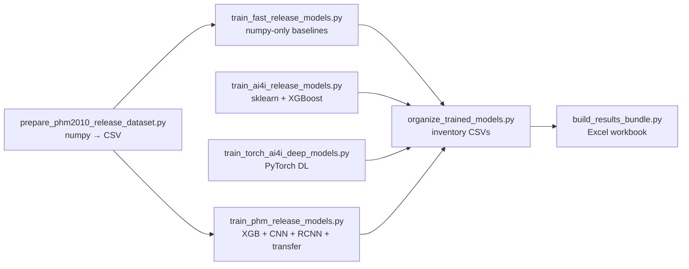

# XAI-PdMNet-Bench Industry 5.0

[**Repository**](https://github.com/tayyabrehman96/XAI-PdMNet-Bench-Industry-5.0) — code-first reproducibility package for **leakage-aware predictive maintenance**. It trains transparent **tabular and deep-learning** models on:

1. **[UCI AI4I 2020](https://archive.ics.uci.edu/dataset/601)** — classical CNC-style tabular telemetry with a known **failure-indicator leakage** pitfall (`TWF` … `RNF` correlated with labels).
2. **PHM 2010 machining challenge (derived splits)** — high-frequency force/vibration tensors windowed into **6 × 500** sequences plus hand-crafted spectro-temporal summaries per cut.

Unlike many **AI4I** reproductions, the default training path (**track B2**) drops the five failure-mode indicator columns **before** building predictors while retaining `Machine failure` as the supervised target — i.e., **evaluation on inputs that approximate deployable telemetry**, free of tautological correlations.

---

## Design philosophy

| Principle | What it means here |
|-----------|---------------------|
| **Script-first reproducibility** | `python scripts/run_all_training.py` sequences every stage; notebooks are optional. |
| **Deterministic artefacts** | `trained_models/` and `results/` are produced by code from `data/` (not transcribed PDF tables). |
| **Cross-benchmark reasoning** | PHM exposes **cutter-wise generalisation** (C1 + C4 → C6) alongside **AI4I hold-out imbalance**. |
| **Transfer as an experiment** | `transfer_ai4i_to_phm` pre-trains an **AI4I B2 encoder** then fine-tunes on PHM tabular features via a learnt linear bridge `PHM ↦ AI4I_dim`. |

For the historical decision log behind these choices see **[TECHNICAL_DECISIONS.md](TECHNICAL_DECISIONS.md)**.

---

## High-level automation flow

Execution order mirrors `scripts/run_all_training.py`:



---

## Dependencies & environment

**Minimum (root):**

```bash
python -m venv .venv
.venv\Scripts\activate              # Windows
pip install --upgrade pip
pip install -r requirements.txt     # numpy, pandas, openpyxl, scikit-learn, xgboost, torch
```

All training scripts prepend `ROOT/src` to **`sys.path`**, so `import xai_pdmbench` works **without** a separate editable install once dependencies are satisfied.

`train_ai4i_release_models.py` needs **NumPy + Pandas + scikit-learn + xgboost**; `train_torch_ai4i_deep_models.py` and `train_phm_release_models.py` need **PyTorch** (CUDA auto-detected in PHM trainer).

### Optional PYTHONPATH overlays

Older automation may ship helper trees `.deps/` or `.deps_runtime/`. Export `XAI_DEPS_PATH=<folder>` **before** running scripts so `PYTHONPATH` includes legacy modules (see `scripts/run_all_training.py`).

### Tunable training budgets (environment variables)

| Variable | Default | Effect |
|----------|---------|--------|
| `AI4I_TORCH_TABULAR_EPOCHS` | `30` | AlexNet‑1D + Tab‑Transformer-ish runs on AI4I flattened vectors |
| `AI4I_TORCH_CNN_LSTM_EPOCHS` | `20` | Sliding-window **CNN+LSTM** on AI4I pseudo sequences |
| `PHM_CNN_EPOCHS` | `35` | 1‑D CNN on PHM windows |
| `PHM_RCNN_EPOCHS` | `35` | Conv + bidirectional **LSTM** stack |
| `PHM_TRANSFER_PRETRAIN_EPOCHS` | `15` | AI4I classifier warm-start |
| `PHM_TRANSFER_FREEZE_EPOCHS` | `10` | Freeze encoder heads on PHM tabular |
| `PHM_TRANSFER_FINETUNE_EPOCHS` | `20` | Joint fine-tuning with small LR |

---

## Data layout

```
data/
  ai4i2020.csv          # Prefer root copy; alternatively data/ai4i/ai4i2020.csv
  ai4i/...
  phm2010/source/originfeature/   # cutter-specific numpy tensors (see below)
    data_x{1,4,6}.npy  # shape (315, 6, 5000) — six channels × 5000 Hz-like samples per cut
    data_y{1,4,6}.npy  # scalar wear advancement per row
```

**AI4I** rows must expose `Machine failure`, the five symptom flags **`TWF, HDF, PWF, OSF, RNF`** (needed for sanitation), telemetry columns, and categorical `Product type`/`Type`.

**Dataset integrity:** `clean_ai4i_benchmark_rows()` removes contradictory records where `RNF ≡ 1` while `Machine failure ≡ 0` or `{flags sum = 0}` while failure is flagged — aligning with audited benchmark hygiene.

See **UCI** licence **CC BY 4.0**; cite DOI **`10.24432/C5HS5C`**.

---

## Feature engineering overview (track B2)

Located in **`src/xai_pdmbench/`**:

1. **`normalize_columns()`** — strips whitespace artefacts from CSV headers so joins remain stable across platforms.
2. **`clean_ai4i_benchmark_rows()`** — enforces coherent label vs symptom flags (`data.py`).
3. **`build_features_b2()`** — **drops leakage columns** (`FAULT_COLUMNS`), deletes identifier columns (`UID`,`UDI`,`Product ID`), then injects seventeen **physics-inspired scalars**:

   Power proxies (`Power_proxy`, logarithmic transforms), rotational/torsional interplay (`RPM_over_torque`), wear-relative channels (`Wear_norm`, `Torque_x_wear`, `Rpm_x_wear`), thermal deltas (`Delta_temp_K`, `Thermal_ratio`, …).

4. **`pd.get_dummies`** expands remaining categorical literals into one-hot columns compatible with sklearn / torch trainers.

Outputs are **`float64` / `float32`** tensors ready for **StandardScaler pipelines** or custom z-score routines.

> **Leakage pedagogical nuance.** Track **B1** (`build_features_b1`) purposely keeps `TWF…RNF`; use only for benchmarking inflated metrics against honest B2 splits.

---

## PHM preprocessing pipeline (`prepare_phm2010_release_dataset.py`)

Each cutter (**C1, C4, C6**) supplies parallel arrays interpreted as **`[samples, channels=6, time=5000]`**.

1. **Temporal decimation.** Every consecutive block of **`5000 → 500`** samples is averaged (non-overlapping) → tensor **`N × 6 × 500`**.
2. **Labels.** Scalar wear **`y`** is binarised via **`failure_label = wear ≥ 152 µm`** (fixed `FAIL_THRESHOLD`).
3. **Outputs.**
   - `phm2010_windows_6x500.csv` — flattened spectro-temporal grid (`ch0_000 … ch5_499`) appended with metadata `{cutter,cut_index,wear,failure_label}` suitable for convolutional ingestion.
   - `phm2010_feature_table.csv` — 54 scalar descriptors per signal channel (mean, std, RMS, min, max, peak-to-peak **plus higher-order moments**: skewness, kurtosis) × six channels ⇒ rich tabular surrogate for vibration physics.
   - `phm2010_dataset_status.csv` + **`phm2010_release_manifest.json`** — bookkeeping for audits/reviewers.

---

## Model zoos — what runs where?

### Phase A — `train_fast_release_models.py` (“dependency‑lite smoke test”)

| Model | Artefact | Notes |
|-------|----------|-------|
| **Weighted logistic (NumPy)** | `numpy_logistic_weighted.npz` | Implements class-reweighted gradient descent with ridge-like shrinkage (`1e-4 * w`). |
| **Diagonal Gaussian NB** | `numpy_gaussian_nb.npz` | Closed-form normals + calibrated log-probability fusion. |
| **k‑NN (k = 5)** | `numpy_knn_k5.npz` | Stores scaled training corpus for deterministic neighbour aggregation. |

**Split policy:** seeded **stratified 80 / 20** per-class with `numpy.random.default_rng(42)`.  
**Normalization:** Train-only empirical mean / σ applied to evaluation fold.

Outputs `results/fast_release_model_metrics.csv`.

### Phase B — `train_ai4i_release_models.py` (traditional ML powerhouse)

Train/test split **`sklearn.model_selection.train_test_split(..., stratify=y, random_state=42, test_size=0.20)`**.

| Model | Artefact(s) |
|-------|--------------|
| `Pipeline(StandardScaler → LogisticRegression(class_weight='balanced'))` | `logistic_regression.joblib` |
| `RandomForestClassifier(500 trees, balanced_subsample)` | `random_forest_ctgan.joblib` |
| `HistGradientBoostingClassifier` (+ `class_weight='balanced'` when supported) | `hist_gradient_boosting_ctgan.joblib` |
| `XGBClassifier` with `scale_pos_weight = (#neg)/( #pos)` | `xgboost_ctgan.json` *(skipped if package missing)* |

Also writes `ai4i_feature_columns.json` + **`results/ai4i_trained_model_metrics.csv`**.

> Filenames historically reference “`_ctgan_`” naming; CTGAN artefacts are handled in scholarly notebooks companion — scripts here focus on **transparent classical learners**.

### Phase C — `train_torch_ai4i_deep_models.py`

All runs share **deterministic RNG seed 42**.

| Architecture | Representation | Highlights |
|--------------|----------------|-----------|
| **`AlexNet1DSafe`** | Treat each sample as **`[1 × F]`** “image” scanned by **`Conv1d` stacks**, global adaptive pooling → MLP logits. | Mirrors compact 1‑D CNN baselines adapted to manufacturing signals. |
| **`TabTransformerSmall`** | **`nn.Linear`** per-feature tokenisation + positional bias + **`TransformerEncoder(2 × layers)`** | Lightweight attention over tabulated sensors. |
| **`CNNLSTM`** | Sliding **window = 10** contiguous rows reshaped **`[batch, seq, feats]`**, conv mixer along temporal axis (`transpose` trick), stacked **two-layer LSTM (64 → 32)**. | Mimics causal temporal reasoning while acknowledging **pseudo-time** artefacts. |

Optimization: **`Adam`** + **`BCEWithLogitsLoss(pos_weight=n_neg/n_pos)`** (empirical imbalance reweight).

**Operational thresholding:** Convolutional+LSTM artefact **`cnn_lstm_thr031`** reports metrics at **`τ = 0.31`** (documented explicitly in filenames + payloads) reflecting PR-oriented threshold calibration.

Exported pairs per model:

```
trained_models/ai4i/<id>.pt            # pickle dict {state_dict + metrics + scaler stats}
trained_models/ai4i/<id>_weights.pt   # Raw state_dict convenience
results/ai4i_deep_pt_model_metrics.csv
results/ai4i_deep_training_config.csv
```

### Phase D — `train_phm_release_models.py`

**Domain split:**

- Train / validation cutters: **C1 + C4** (210 cuts each → combined ~420 rows before internal val split).
- Test cutter: **C6** unseen domain.

**Branches:**

| Model | Inputs | Artefacts |
|-------|--------|-----------|
| `xgboost_phm.json` | 54‑dim tabular feats | Histogram-based boosting with `scale_pos_weight`. |
| `cnn1d_phm.pt` | Tensor **`[batch, 6 channels, length 500]`** | Three-layer **Conv1d + BN + ReLU**, adaptive pooling classifier. |
| `rcnn_phm.pt` | Same windows convolved → **Bidirectional LSTM (64 × 2 states)** recurrent head. |
| `transfer_ai4i_to_phm.pt` | PHM scaled vectors → **`Linear`** projection matching AI4I width → pretrained **`AI4IEncoder`** (two-layer MLP) | **Freeze-then-unfreeze curriculum** mimicking domain adaptation with explicit normalisation artefacts saved (AI4I + PHM means/stds serialized). |

**Early stopping**: validation **PR‑AUC** monitoring with configurable patience (`patience=15` default during heavy loops).

Writes `results/phm_model_metrics.csv`, `results/phm_training_config.csv`, and `trained_models/phm2010/phm_feature_columns.json`.

---

## Artefact inventories & spreadsheets

After training **always** regenerate indexes:

```
python scripts/organize_trained_models.py         # expects prior training stages
python scripts/build_results_bundle.py           # merges metric CSVs → Excel summaries
```

Key consumer files:

| File | Meaning |
|------|---------|
| `trained_models/ALL_TRAINED_MODELS_INVENTORY.csv` | Byte sizes + `{present:true/false}` for every expected artefact filename. |
| `results/model_inventory.csv` | Mirror subset for spreadsheets. |
| `results/reproduction_results_bundle.xlsx` | Consolidated KPI tables assembled **only** by repository tooling. |

---

## One-command rerun

From repository root:

```bash
pip install -r requirements.txt    # refresh stack
pip install -e .
python scripts/run_all_training.py
```

Runtime scales with GPU availability (**PHM** deep stages benefit massively from CUDA).

---

## Limitations (read before citing huge PR numbers)

1. **Scale & sampling:** Scripts favour **engineering transparency** over Kaggle leaderboard tuning — treat metrics as reproducible anchors, not SOTA chasing.
2. **Pseudo‑temporal stacking on AI4I:** Sliding windows artificially impose order; correlations **do not imply true plant chronology**.
3. **Threshold naming:** **`cnn_lstm_thr031`** bakes **`0.31`** threshold into evaluation — document when comparing vs default `0.5` models.
4. **PHM domain shift:** Leaving **C6** entirely out-of-distribution validates robustness assumptions but lowers absolute F1 versus random CV on one cutter.

---

## Citation hint

Credit **this GitHub codebase** alongside the curated **datasets** (**UCI DOI 10.24432/C5HS5C** and PHM citation per original challenge rules).

If [`CITATION.cff`](CITATION.cff) / [`CITATION.bib`](CITATION.bib) are present — use GitHub's **“Cite this repository”**.

---

## Further reading inside the repo

- **[TECHNICAL_DECISIONS.md](TECHNICAL_DECISIONS.md)** — granular rationale catalogue.
- **`src/xai_pdmbench/*.py`** — canonical cleaning + leakage-safe transformations.
- **`scripts/*.py`** — source of truth for hyperparameters encoded directly in constructors.
