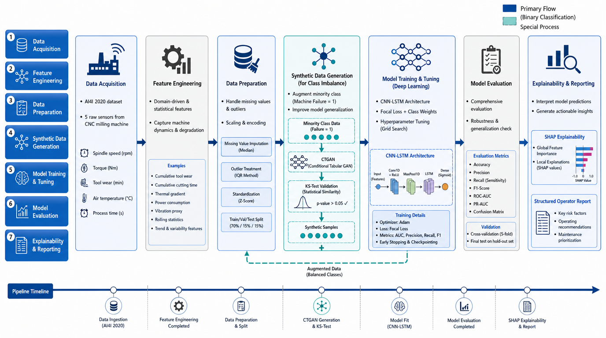

# Beyond Data Leakage: Explainable Predictive Maintenance for Industry 5.0

Official code and notebook companion for the research framework **XAI-PdMNet-Bench**  
(AI4I 2020, leakage-safe features, CTGAN, XGBoost/CNN–LSTM, SHAP, template-based reporting).

**Public repository:**  
[github.com/tayyabrehman96/Beyond-Data-Leakage-An-Explainable-Predictive-Maintenance-Benchmarking-Framework-for-Industry-5.0](https://github.com/tayyabrehman96/Beyond-Data-Leakage-An-Explainable-Predictive-Maintenance-Benchmarking-Framework-for-Industry-5.0)

---

## Dataset and CSV

| Item | Detail |
|------|--------|
| **Name** | AI4I 2020 Predictive Maintenance |
| **Registry** | [UCI Machine Learning Repository — dataset ID 601](https://archive.ics.uci.edu/dataset/601/ai4i+2020+predictive+maintenance+dataset) |
| **DOI** | [10.24432/C5HS5C](https://doi.org/10.24432/C5HS5C) |
| **Licence** | CC BY 4.0 |
| **Direct CSV (HTTPS)** | [`https://archive.ics.uci.edu/ml/machine-learning-databases/00601/ai4i2020.csv`](https://archive.ics.uci.edu/ml/machine-learning-databases/00601/ai4i2020.csv) |

**Bundled copy in this repo:** [`data/ai4i2020.csv`](data/ai4i2020.csv) is a byte-for-byte mirror of the official UCI file above (helps **offline cloning** / stable paths in tutorials). Attribution is unchanged: cite **UCI + DOI** and respect **CC BY 4.0** (see [`data/README.md`](data/README.md)).

**Using your own download:** point the notebook / env at a local path, e.g. `PDM_AI4I_CSV=/path/to/ai4i2020.csv`.

**Leakage note:** columns `TWF`, `HDF`, `PWF`, `OSF`, `RNF` are logically derived from `Machine failure`. For deployment-style benchmarks, use **track B2** (drop those columns as inputs). Track **B1** may retain them only for controlled reproduction comparisons.

---

## What this repository contains (curated, not a full dump)

| Path | Purpose |
|------|---------|
| [`data/ai4i2020.csv`](data/ai4i2020.csv) | Offline-friendly **AI4I 2020** CSV (**UCI mirror**; attribution in [`data/README.md`](data/README.md)) |
| [`colab/`](colab/) | Google Colab workflow: main notebook, generator, `requirements.txt`, Colab-specific README |
| [`src/xai_pdmbench/`](src/xai_pdmbench/) | Small **reusable** library: UCI constants, Ileri-style cleaning, **B1/B2** feature builders (matches notebook logic) |
| [`docs/ARCHITECTURE.md`](docs/ARCHITECTURE.md) | End-to-end pipeline + **Mermaid** architecture (renders on GitHub) |
| [`scripts/export_notebook_cells.py`](scripts/export_notebook_cells.py) | Splits the `.ipynb` into many `.py`/`.md` files under `colab/notebook_export/` for review and partial reuse |
| [`generate_figures.py`](generate_figures.py) | Local script to regenerate figures into `Paper research/` (ignored by Git); also refreshes **`docs/assets/architecture.png`** for the README |
| [`docs/REPO_UPLOAD_CHECKLIST.md`](docs/REPO_UPLOAD_CHECKLIST.md) | Checklist of what belongs on GitHub vs what to omit |

**Intentionally omitted from Git** (see [`.gitignore`](.gitignore)): manuscript drafts and full figure sets under `Paper research/`, trained weights, `ARTIFACTS/`, checkpoints, cached CSV copies, API keys, scratch notebooks, and bulky export packs. Upload only what your paper needs; use Releases or Zenodo for frozen artifact bundles.

---

## Quick start

### 1) Environment

```bash
python -m venv .venv
.venv\Scripts\activate   # Windows
pip install -r colab/requirements.txt
pip install -e .         # optional editable install of xai_pdmbench
```

Editable install uses [`pyproject.toml`](pyproject.toml) (see below).

### 2) Regenerate the main Colab notebook (optional)

After editing cell sources in [`colab/gen_notebook.py`](colab/gen_notebook.py):

```bash
python colab/gen_notebook.py
```

### 3) Export notebook into multiple files (for navigation / code review)

```bash
python scripts/export_notebook_cells.py
```

Output: `colab/notebook_export/` — one file per cell (`cell_000_intro.md`, `cell_005_code.py`, …). **Not** a substitute for the full notebook in Colab; use the `.ipynb` for execution.

### 4) Use the Python modules in your own script

```python
import pandas as pd
from xai_pdmbench.constants import AI4I_CSV_URL
from xai_pdmbench.data import normalize_columns, clean_ai4i_basepaper
from xai_pdmbench.features import build_features_b2

# Offline / stable path inside a clone:
df = pd.read_csv("data/ai4i2020.csv")
# Or HTTPS (canonical UCI):
# df = pd.read_csv(AI4I_CSV_URL)

df = normalize_columns(df)
df = clean_ai4i_basepaper(df)
X, y = build_features_b2(df)
```

Constant for the bundled relative path (for notebooks or scripts): **`AI4I_BUNDLED_CSV_REPO_RELATIVE`** in [`src/xai_pdmbench/constants.py`](src/xai_pdmbench/constants.py).

---

## CNN–LSTM architecture (Fig. 7 — `fig7_architecture`)

The sequence model used in **XAI-PdMNet-Bench** is a **Conv1D + LSTM** stack that maps **fixed-length sliding windows** to a **fault probability** `P(fault) ∈ [0, 1]`. The schematic below matches the **`fig7_architecture`** renderer in **`generate_figures.py`** and is tracked as **`docs/assets/architecture.png`** for GitHub and slides (also embedded below at full width).

<p align="center">
  
</p>

### What each box means (left → right)

1. **Input block — tensor shape `[N, 10, 25]` (batch × time × channels)**  
   A batch contains **N** independent windows; each window has **T = 10** synthetic steps (sliding-history length); every step carries **F = 25** numeric scalars computed under **track B2**, i.e., **after dropping leakage-prone failure indicators** (`TWF` … `RNF`) from the predictor set. Purely tabular rows are unfolded into overlapping snippets so convolution and recurrence can summarize **short-range variability** inside each snippet.

2. **Feature extraction — stacked `Conv1D` blocks with `ReLU`**  
   - First convolution: **64** filters with **kernel size 3** along the temporal axis, learning small temporal motifs that mix neighbouring synthetic timesteps while keeping kernel capacity modest.  
   - Second convolution: **32** filters (**k = 3**), deepening the receptive field before pooling.

3. **`MaxPool1D` (`pool_size = 2`)**  
   Halves temporal resolution to reduce parameters and coerce **positional invariances similar to coarse time alignment** — important when window boundaries are heuristic rather than true clock-cycles.

4. **Temporal backbone — dual `LSTM` stack**  
   - **First `LSTM`:** **64** hidden units with `return_sequences=True`, emitting a latent vector **at each pooled timestep** so high-level ordering is retained until the classifier collapses time.  
   - **Second `LSTM`:** **32** units summarises those sequence outputs into **one latent code** preceding the dense head.

5. **Regularisation — `Dropout(0.30)` after the first `LSTM` stage, **`Dropout(0.20)` after the second `LSTM`, before logits**  
   Mitigates overfitting given **severe class imbalance** and **narrow failure modes** typical of AI4I (matches ordering in **`fig7_architecture`**).

6. **Classifier head — `Dense(16) + ReLU` → `Dense(1) + Sigmoid`**  
   Maps the final temporal summary to **`P(fault)`**. Training uses **balanced targets + focal framing** consistent with the Colab backbone (threshold **`τ*`** tuned on validation is applied **after** logits are converted to calibrated operating points for PR‑AUC‑oriented ops).

### How this fits the six-stage manuscript pipeline

Cleaning and **B2** leakage handling happen **before** this network sees tensors. Optionally, **class imbalance tooling** (`CTGAN`, `SMOTE`, class weights) feeds **tabular** learners in parallel branches. [`docs/ARCHITECTURE.md`](docs/ARCHITECTURE.md) shows the broader **six-stage pipeline** diagram (Stages 1–6).

### Regenerating the figure

Running **`python generate_figures.py`** executes **`fig7_architecture`** (among others): PNGs render under **`Paper research/`** (**git‑ignored**) and **`docs/assets/architecture.png`** is **refreshed in place** so the README bitmap stays reproducible without manually copying files.

---

## Related references

- Base CNN benchmark (leakage-prone setting in many reproductions): Ileri, Altun, Narin (2024), *Appl. Sci.* — [DOI 10.3390/app14114899](https://doi.org/10.3390/app14114899)
- CTGAN: Xu et al., *NeurIPS* DGM workshop — SDV implementation in notebook
- SHAP: Lundberg & Lee — [TreeExplainer / GradientExplainer](https://github.com/slundberg/shap)

---

## Citation

Use the citation block from your forthcoming *Sensors* / MDPI manuscript when available. Until then, cite the repository URL and the UCI dataset DOI above.

---

## Licence

Code in this repository is provided for research reproduction. The **AI4I 2020** data remain under **CC BY 4.0** (UCI).

