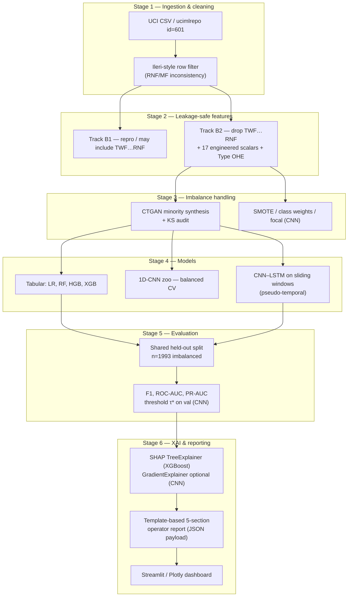

# XAI-PdMNet-Bench — System architecture

This document matches the six-stage pipeline described in the manuscript: **ingestion → leakage-safe features → CTGAN audit → multi-model training → held-out evaluation → SHAP + operator report + dashboard**.

---

## High-level data flow (Mermaid)

The diagram below renders automatically on GitHub when viewing this file.

---

## Component responsibilities

| Stage | Input | Output | Notes |
|-------|--------|--------|-------|
| 1 | Raw AI4I rows | `df_clean` | ~27 rows dropped; see `clean_ai4i_basepaper` in [`src/xai_pdmbench/data.py`](../src/xai_pdmbench/data.py) |
| 2 | Clean frame | `X_b1`/`X_b2`, `y` | B2 aligns with manuscript 25-dim tabular design |
| 3 | Training split | Augmented tensors / tables | CTGAN trained on failure-only rows; marginal KS on 25 features |
| 4 | Augmented training | Fitted models | Stratified 68/12/20 split; seeds fixed in notebook |
| 5 | Test split | Metrics CSV, curves | PR-AUC primary for imbalance; CNN uses tuned τ* |
| 6 | Best backbone + test batch | SHAP + report + figures | Production path: XGBoost + TreeExplainer |

---

## Pseudocode alignment (Colab)

| Colab step | Maps to |
|------------|---------|
| Step 1 | `ARTIFACTS`, seeds, progress tracker |
| Step 2 | Load CSV, `clean_ai4i_basepaper`, `build_features_b*` |
| Step 3 | Shallow ML + 1D-CNN CV |
| Step 4 | CNN–LSTM + optional CTGAN/SMOTE branches |
| Step 5–6 | Metrics, ROC/PR, SHAP, export |

---

## CNN–LSTM backbone (tracked bitmap — `fig7_architecture`)

The schematic below duplicates **`docs/assets/architecture.png`** in the repo and mirrors the **`fig7_architecture()`** emitter in **`generate_figures.py`** (Conv1D feature extraction → `MaxPool1D` → stacked LSTM with dropout tiers → dense + sigmoid for `P(fault)`).

Reading order follows the boxed pathway left-to-right:

1. **Input `[N,10,25]`** — Sliding windows reshape **tabular B2 features** (`TWF…RNF` removed from inputs) into **pseudo-time** so kernels scan short contexts.
2. **Conv stacks** learn local temporal motifs; pooling halves the synthetic clock rate.
3. **Dual `LSTM` cells** summarise the convolved trajectory; dropout isolates latent units from class-specific memorisation artefacts.
4. **Dense bottleneck + sigmoid** emit calibrated fault logits suitable for imbalance-aware thresholding (**`τ*`** on validation in the notebook stack).

Cross-link: the **[root `README.md`](../README.md)** reproduces this figure with prose tailored for repository visitors unfamiliar with Stage 6 XAI artefacts.
